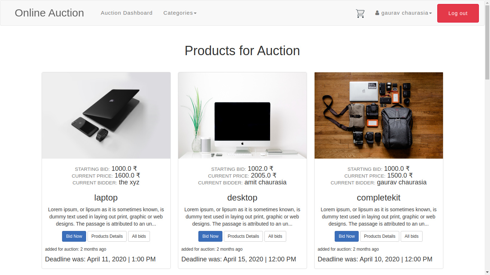
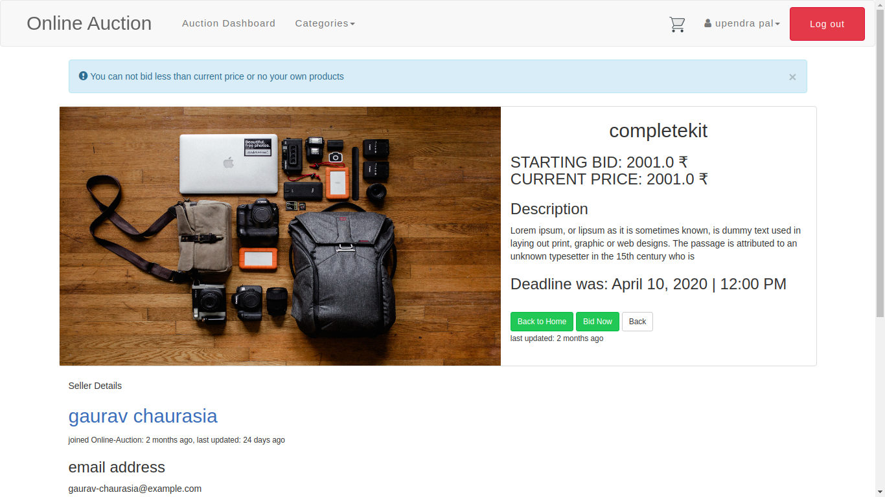
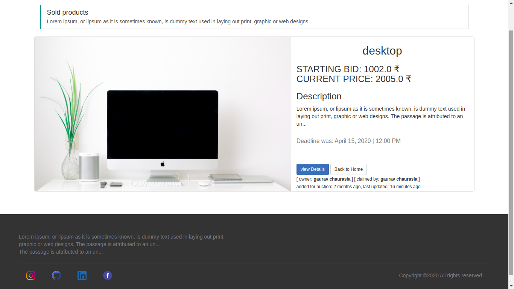
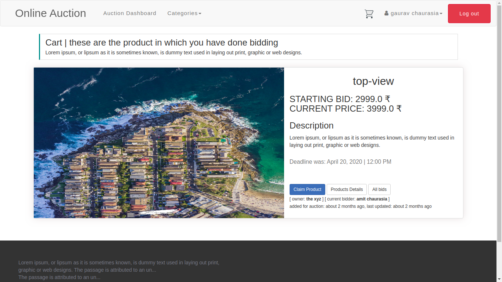
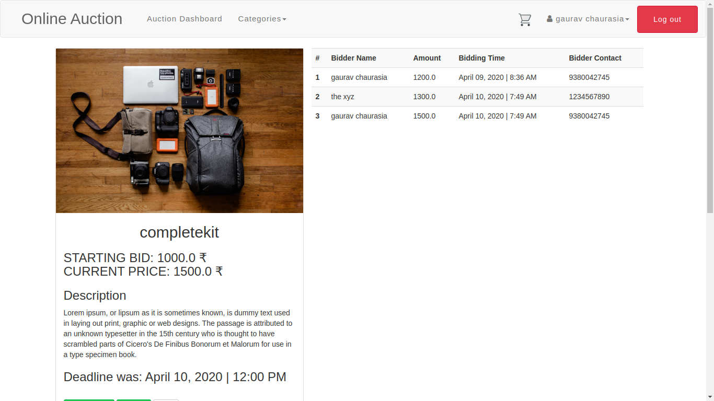
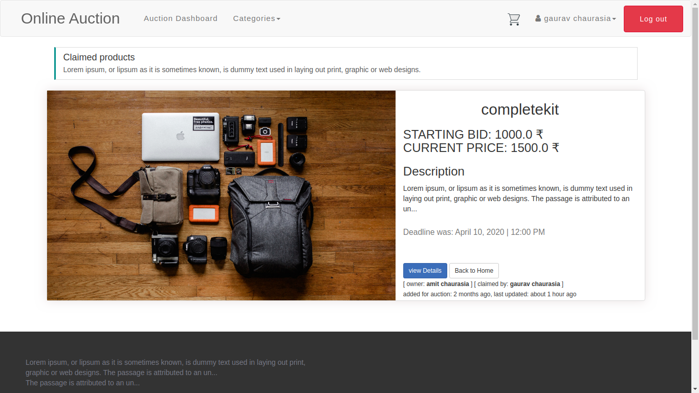

# Online Auction 

> Note: All steps were performed using Ubuntu 18.04.4 LTS.


### Installation needed for running application


a) Install MySQL and setup using these commands, make sure the password you select is easy to remember
```
        $ sudo apt install mysql-server 
        $ sudo mysql_secure_installation
```
                    or               
```
        $ sudo apt-get install mysql-server
```

for my case, I found the second one easy as while installation I get an interface in terminal asking for a password and could diminish some step  for secure_installation which I feel a very annoying step
Note: After this setup, you should be able to run MySQL using this command, if not then try some of these issue links 
```
        $ mysql -u root -p
```

(In case you get the wrong password, do `sudo su`, then `mysql` create a new user with password and use that)  
          If you face error 1698`https://stackoverflow.com/questions/39281594/error-1698-28000-access-denied-for-user-rootlocalhost`      
          if you face error 1045`https://stackoverflow.com/questions/21944936/error-1045-28000-access-denied-for-user-rootlocalhost-using-password-y`  

b) Installing RubyOnRails using rvm (ruby version manager)
   First, install curl and gnupg
```
        $ sudo apt install curl
        $ sudo apt install gnupg2
``` 

   Now, run these commands to install rvm
```
        curl -sSL https://rvm.io/mpapis.asc | gpg2 --import -  
        \curl -sSL https://get.rvm.io | bash -s stable
```

**Important**: For RVM to work properly, you have to check the 'Run command as login shell' checkbox on the Title and Command tab of the terminal's Edit ▸ Profile Preferences menu dialog, in case the menu is missing right-click the terminal app and navigate Profiles ▸ Profile 

Now, we will be using rails 5.2.2 with ruby 2.6.1
```
        $ rvm install 2.6.1
        $ rvm use 2.6.1 --default
        $ gem install bundler
        $ gem install rails -v 5.2.2
```

Install mysql gem and the libmysql-dev library
```
        $ sudo apt install libmysqld-dev
        $ gem install mysql2
```

Note: For some of the js gems
```
        $ sudo apt install nodejs
```

### DONE THE INSTALLATIONS

* Clone the Repo:
```
        $ git clone https://github.com/gaurav-chaurasia/Online-Auction 
```
* Change directory into the folder named Online-Auction
* Install all the gems
```
        $ bundle install
```
* Make migrations, Seed data into the database and Run the test server
```
        $ rake db:migrate
        $ rake db:seed
        $ rails server
```
* The above steps starts the development server on localhost:3000. Go to `http://localhost:3000/` in your browser. It will automatically redirect you to the Home page and then ask for Signup or Login.


* bootstrap-sass 3 used for styling many parts of the app and after adding small changes final could build beautiful UI

```
       $ gem 'bootstrap-sass', '~> 3.4.1'

``` 

## List of all implemented features,
  

* Image upload capability
* seperate dashboard for sold and claimed products
* "Active storage used for image storing feature"
* only owner can edit, delete and update their products
* show page for separate user and user can see their products  *USER DASHBOARD*
* bid option for different user's products for own product view details option shown
* "all products are shown with created time and updated time also with user details(seller details)"
* description is for clarifying the product details

## List of non-implemented/planned features,

* Categories can be added to the product and 
* user can search for products based on their category 
* more image can be added for the same product 
* user can have their profile picture and some more details 
* live chat functionality can be added so buyer and seller can discuss about the product any time

> code optimization
* convention has not been followed well helper methods used instead of model method
* lots logic present in view and controller instead of model
* more model methods can be used

> some links
      
`https://guides.rubyonrails.org/`  
`https://github.com/twbs/bootstrap-sass`    
`https://github.com/heartcombo/devise`   
`https://github.com/bokmann/font-awesome-rails`   


> SOME SCREEN SHOTS OF COMPLEATE WORKING ONLINE AUCTION WEB APP

> home-page



>alerts-product-details-page



> sold-product-page



> cart



> bidding



> claimed-product-page


